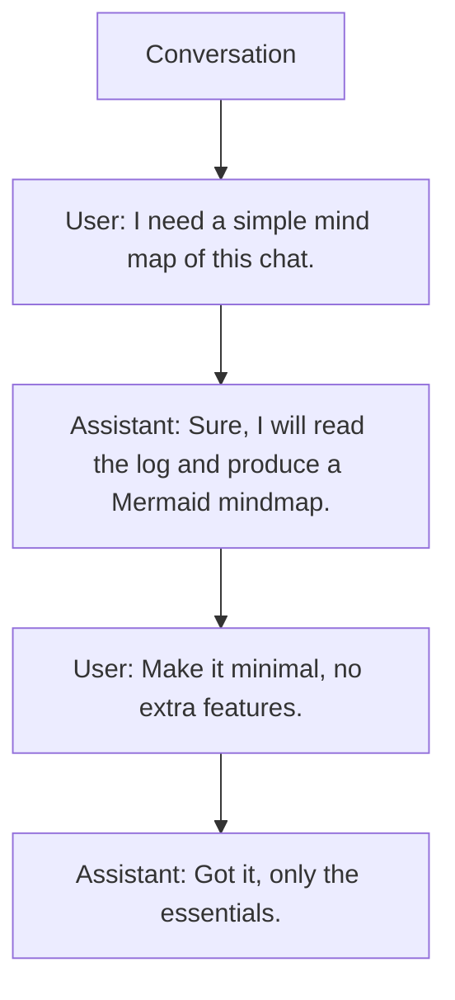

```mermaid
graph TD
  n0["Conversation"]
  n1["User: I need a simple mind map of this chat."]
  n2["Assistant: Sure, I will read the log and produce a Mermaid mindmap."]
  n3["User: Make it minimal, no extra features."]
  n4["Assistant: Got it, only the essentials."]
  n0 --> n1
  n1 --> n2
  n2 --> n3
  n3 --> n4
```
