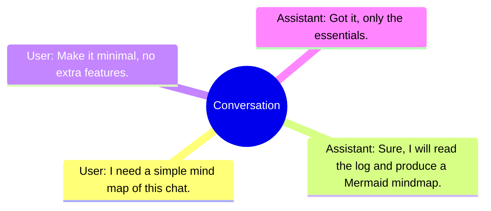

```mermaid
mindmap
  root((Conversation))
    User: I need a simple mind map of this chat.
    Assistant: Sure, I will read the log and produce a Mermaid mindmap.
    User: Make it minimal, no extra features.
    Assistant: Got it, only the essentials.
```
